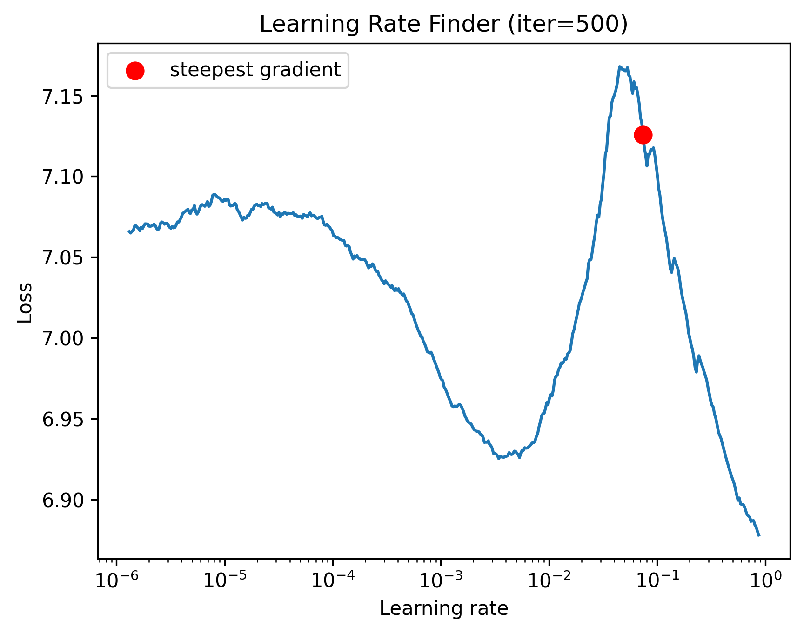
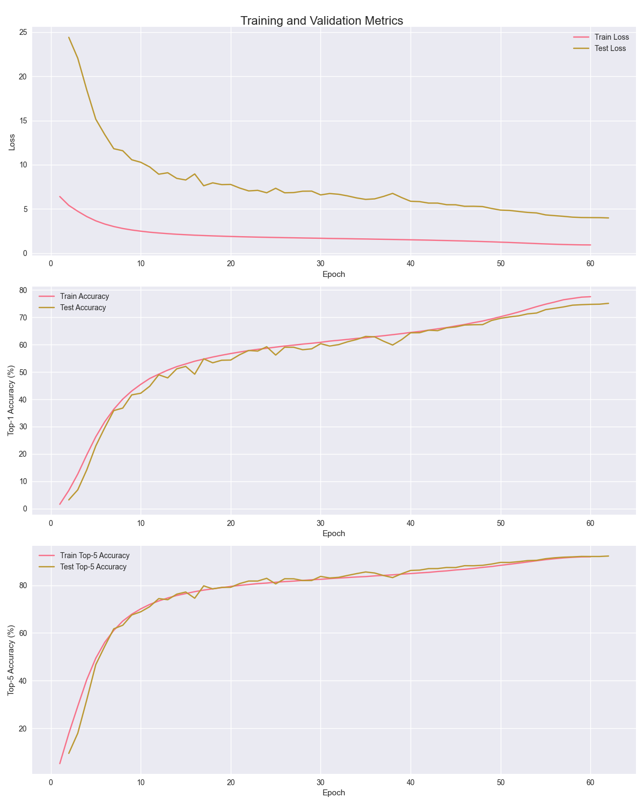
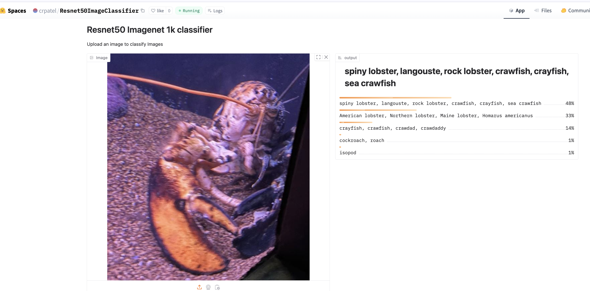
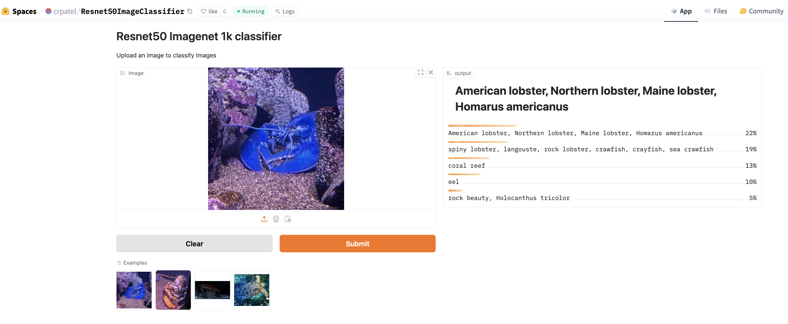
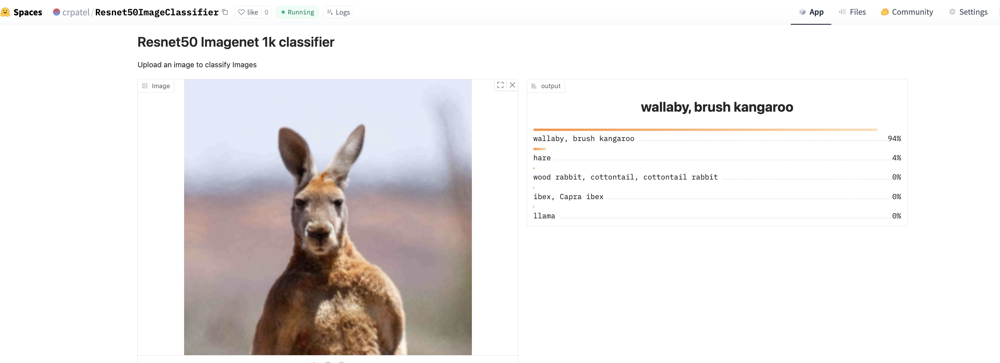
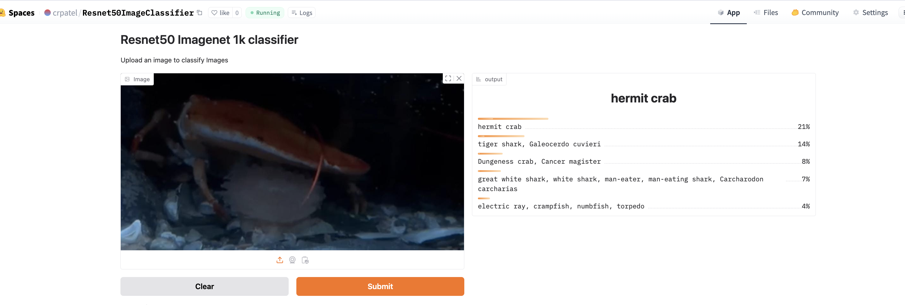

# Resnet50-Imagenet1K Training from scratch on AWS

- This is attempt to train Resnet50 Model from scratch using Resnet 50 Model  on Imagenet 1000 classes
- Imagenet 1000 classes is a dataset of 1.2 million train images with 1000 classes, 50000 validation images with 1000 classes and 100000 test images with 1000 classes. Dataset total size is around 160 GB.
- The dataset is available on [Imagenet](https://www.image-net.org/index.php)
- Dataset is also available on [Kaggle](https://www.kaggle.com/c/imagenet-object-localization-challenge/data)
- I used kaggle dataset for this project.

## Infrastructure set up

I used AWS EC2 instance for this project.
- Instance type: g5.12xlarge (4 GPU 24 GB RAM, 32 vCPUs, 192 GB CPU RAM, 4 * NVIDIA A10G Tensor Core GPUs)
- Storage volume: 390 GB EBS storage
- Cost of Training approximately $ 32
- Training time 20 hours ( 17 hours, then again for 3 hours when spot instance was interupted) 


### Creating a Volume for Training
```bash
# 1. First launch small t3.xlarge instance
sudo apt-get update 
# install pip
sudo apt install python3-pip -y
# install unzip
sudo apt install unzip
sudo apt install pipx 
pipx install setuptools==59.8.0 # kaggle cli require this
#install aws cli if needed
curl "https://awscli.amazonaws.com/awscli-exe-linux-x86_64.zip" -o "awscliv2.zip"
unzip awscliv2.zip
sudo ./aws/install
export AWS_ACCESS_KEY_ID='YOUR_VAL'
export AWS_SECRET_ACCESS_KEY='YOUR_VAL'
export AWS_DEFAULT_REGION='YOUR_VAL'

# 1. Create a 390GB gp3 volume in the same AZ as your instance (us-east-1a)
aws ec2 create-volume \
    --volume-type gp3 \
    --size 390 \
    --availability-zone us-east-1a \
    --tag-specifications 'ResourceType=volume,Tags=[{Key=Name,Value=ImageNet-Data}]'
# Note the VolumeId from output
# 2. Attach the volume to the instance
aws ec2 attach-volume \
    --volume-id vol-xxxx \
    --instance-id i-xxxx \
    --device /dev/sdf

aws ec2 attach-volume \
    --volume-id vol-012625c007b625251 \
    --instance-id i-03c363f9ddd8ea3ec \
    --device /dev/sdf

# 3. Create filesystem
# (sudo mkfs -t ext4 /dev/xvdf)
sudo mkfs -t ext4 /dev/nvme1n1 
# 4. Create mount point and mount
sudo mkdir -p /mnt/data
sudo mount /dev/nvme1n1  /mnt/data

sudo chown -R ubuntu:ubuntu /mnt/data

df -h

# 5. Download dataset
#make sure you go in mounted directory which has size to store huge data 
cd /mnt/data 
sudo apt update
sudo apt install -y aria2 # this is require to download imagenet dataset from imagenet torrent website
MAGNET_LINK='magnet:?xt=urn:btih:943977d8c96892d24237638335e481f3ccd54cfb&tr=https%3A%2F%2Facademictorrents.com%2Fannounce.php&tr=udp%3A%2F%2Ftracker.coppersurfer.tk%3A6969&tr=udp%3A%2F%2Ftracker.opentrackr.org%3A1337%2Fannounce'
aria2c   --dir=/mnt/data   --enable-rpc=false   --max-concurrent-downloads=1   --continue=true   --seed-time=0   "$MAGNET_LINK" &

# 6. prepare dataset
tar -xzf ILSVRC2017_CLS-LOC.tar.gz

mkdir imagenet

mv ILSVRC/Data/CLS-LOC/train imagenet

mv ILSVRC/Data/CLS-LOC/val imagenet

mv ILSVRC/Data/CLS-LOC/test imagenet


# to prepare validation data properly in directory structure
wget https://raw.githubusercontent.com/soumith/imagenetloader.torch/master/valprep.sh
mv valprep.sh imagenet/val
cd /mnt/data/imagenet/val
sh valprep.sh
rm valprep.sh

# 7. Create snapshot of the volume
aws ec2 create-snapshot \
    --volume-id vol-xxxxxx \
    --description "ImageNet Dataset" \
    --tag-specifications 'ResourceType=snapshot,Tags=[{Key=Name,Value=ImageNet-Snapshot}]'

## note down the snapshot id


# 8. delete the old volume
# follow this if snapshot is succesfully created. VERY IMPORTANT
aws ec2 delete-volume --volume-id vol-xxxxxx --region us-east-1
# stop and terminate the instance
aws ec2 stop-instances --instance-ids i-xxxxxx --region us-east-1
aws ec2 terminate-instances --instance-ids i-xxxxxx --region us-east-1


```

### Training

```bash
## now launch a new instance from aws console ui g5.8xlarge Deep Learning AMI Ubuntu create persistent spot instance
# note down instance id
# attach the volume to the instance
# g5.8xlarge instance type has 1 GPU 24 GB RAM, 32 vCPUs, 128 GB CPU RAM, 1 * NVIDIA A10G Tensor Core GPUs
aws ec2 create-volume \
    --snapshot-id snap-xxxx \
    --volume-type gp3 \
    --size 420 \
    --availability-zone us-east-1c \
    --tag-specifications 'ResourceType=volume,Tags=[{Key=Name,Value=ImageNet-Data}]'

aws ec2 attach-volume \
    --volume-id vol-xxx \
    --instance-id i-xxx \
    --device /dev/xvdf
# ssh into the instance
DEVICE_NAME=$(lsblk -o NAME,MOUNTPOINT | grep -v 'MOUNTPOINT' | grep -E 'nvme|xvd' | awk '{print "/dev/"$1}' | tail -n1)

sudo mkdir -p /mnt/data
sudo mount $DEVICE_NAME /mnt/data
sudo chown -R ubuntu:ubuntu /mnt/data
# mount the volume to the instance
# run the training script   
conda init
conda activate pytorch
tmux new -t train
pip install nvitop # gpu monitoring tool
python3 lr_finder.py # find infromation about max_lr and starting lr we should use for one cycle policy
nohup python3 trainer_g512xlarge.py > train.log 2>&1 &
# monitor training progress
tail -f train.log

```
## Training Strategy
- Single Node Multi GPU training (4) using DDP strategy
- Basic Data Augmentation
- Mixed Precision Training Fp16
- Learning Rate found using LR Finder
- One Cycle Learning Policy

## LR Finder Results

## Model Architecture
```
----------------------------------------------------------------
        Layer (type)               Output Shape         Param #
================================================================
            Conv2d-1         [-1, 64, 112, 112]           9,408
       BatchNorm2d-2         [-1, 64, 112, 112]             128
              ReLU-3         [-1, 64, 112, 112]               0
         MaxPool2d-4           [-1, 64, 56, 56]               0
            Conv2d-5           [-1, 64, 56, 56]           4,096
       BatchNorm2d-6           [-1, 64, 56, 56]             128
              ReLU-7           [-1, 64, 56, 56]               0
            Conv2d-8           [-1, 64, 56, 56]          36,864
       BatchNorm2d-9           [-1, 64, 56, 56]             128
             ReLU-10           [-1, 64, 56, 56]               0
           Conv2d-11          [-1, 256, 56, 56]          16,384
      BatchNorm2d-12          [-1, 256, 56, 56]             512
           Conv2d-13          [-1, 256, 56, 56]          16,384
      BatchNorm2d-14          [-1, 256, 56, 56]             512
             ReLU-15          [-1, 256, 56, 56]               0
       Bottleneck-16          [-1, 256, 56, 56]               0
           Conv2d-17           [-1, 64, 56, 56]          16,384
      BatchNorm2d-18           [-1, 64, 56, 56]             128
             ReLU-19           [-1, 64, 56, 56]               0
           Conv2d-20           [-1, 64, 56, 56]          36,864
      BatchNorm2d-21           [-1, 64, 56, 56]             128
             ReLU-22           [-1, 64, 56, 56]               0
           Conv2d-23          [-1, 256, 56, 56]          16,384
      BatchNorm2d-24          [-1, 256, 56, 56]             512
             ReLU-25          [-1, 256, 56, 56]               0
       Bottleneck-26          [-1, 256, 56, 56]               0
           Conv2d-27           [-1, 64, 56, 56]          16,384
      BatchNorm2d-28           [-1, 64, 56, 56]             128
             ReLU-29           [-1, 64, 56, 56]               0
           Conv2d-30           [-1, 64, 56, 56]          36,864
      BatchNorm2d-31           [-1, 64, 56, 56]             128
             ReLU-32           [-1, 64, 56, 56]               0
           Conv2d-33          [-1, 256, 56, 56]          16,384
      BatchNorm2d-34          [-1, 256, 56, 56]             512
             ReLU-35          [-1, 256, 56, 56]               0
       Bottleneck-36          [-1, 256, 56, 56]               0
           Conv2d-37          [-1, 128, 56, 56]          32,768
      BatchNorm2d-38          [-1, 128, 56, 56]             256
             ReLU-39          [-1, 128, 56, 56]               0
           Conv2d-40          [-1, 128, 28, 28]         147,456
      BatchNorm2d-41          [-1, 128, 28, 28]             256
             ReLU-42          [-1, 128, 28, 28]               0
           Conv2d-43          [-1, 512, 28, 28]          65,536
      BatchNorm2d-44          [-1, 512, 28, 28]           1,024
           Conv2d-45          [-1, 512, 28, 28]         131,072
      BatchNorm2d-46          [-1, 512, 28, 28]           1,024
             ReLU-47          [-1, 512, 28, 28]               0
       Bottleneck-48          [-1, 512, 28, 28]               0
           Conv2d-49          [-1, 128, 28, 28]          65,536
      BatchNorm2d-50          [-1, 128, 28, 28]             256
             ReLU-51          [-1, 128, 28, 28]               0
           Conv2d-52          [-1, 128, 28, 28]         147,456
      BatchNorm2d-53          [-1, 128, 28, 28]             256
             ReLU-54          [-1, 128, 28, 28]               0
           Conv2d-55          [-1, 512, 28, 28]          65,536
      BatchNorm2d-56          [-1, 512, 28, 28]           1,024
             ReLU-57          [-1, 512, 28, 28]               0
       Bottleneck-58          [-1, 512, 28, 28]               0
           Conv2d-59          [-1, 128, 28, 28]          65,536
      BatchNorm2d-60          [-1, 128, 28, 28]             256
             ReLU-61          [-1, 128, 28, 28]               0
           Conv2d-62          [-1, 128, 28, 28]         147,456
      BatchNorm2d-63          [-1, 128, 28, 28]             256
             ReLU-64          [-1, 128, 28, 28]               0
           Conv2d-65          [-1, 512, 28, 28]          65,536
      BatchNorm2d-66          [-1, 512, 28, 28]           1,024
             ReLU-67          [-1, 512, 28, 28]               0
       Bottleneck-68          [-1, 512, 28, 28]               0
           Conv2d-69          [-1, 128, 28, 28]          65,536
      BatchNorm2d-70          [-1, 128, 28, 28]             256
             ReLU-71          [-1, 128, 28, 28]               0
           Conv2d-72          [-1, 128, 28, 28]         147,456
      BatchNorm2d-73          [-1, 128, 28, 28]             256
             ReLU-74          [-1, 128, 28, 28]               0
           Conv2d-75          [-1, 512, 28, 28]          65,536
      BatchNorm2d-76          [-1, 512, 28, 28]           1,024
             ReLU-77          [-1, 512, 28, 28]               0
       Bottleneck-78          [-1, 512, 28, 28]               0
           Conv2d-79          [-1, 256, 28, 28]         131,072
      BatchNorm2d-80          [-1, 256, 28, 28]             512
             ReLU-81          [-1, 256, 28, 28]               0
           Conv2d-82          [-1, 256, 14, 14]         589,824
      BatchNorm2d-83          [-1, 256, 14, 14]             512
             ReLU-84          [-1, 256, 14, 14]               0
           Conv2d-85         [-1, 1024, 14, 14]         262,144
      BatchNorm2d-86         [-1, 1024, 14, 14]           2,048
           Conv2d-87         [-1, 1024, 14, 14]         524,288
      BatchNorm2d-88         [-1, 1024, 14, 14]           2,048
             ReLU-89         [-1, 1024, 14, 14]               0
       Bottleneck-90         [-1, 1024, 14, 14]               0
           Conv2d-91          [-1, 256, 14, 14]         262,144
      BatchNorm2d-92          [-1, 256, 14, 14]             512
             ReLU-93          [-1, 256, 14, 14]               0
           Conv2d-94          [-1, 256, 14, 14]         589,824
      BatchNorm2d-95          [-1, 256, 14, 14]             512
             ReLU-96          [-1, 256, 14, 14]               0
           Conv2d-97         [-1, 1024, 14, 14]         262,144
      BatchNorm2d-98         [-1, 1024, 14, 14]           2,048
             ReLU-99         [-1, 1024, 14, 14]               0
      Bottleneck-100         [-1, 1024, 14, 14]               0
          Conv2d-101          [-1, 256, 14, 14]         262,144
     BatchNorm2d-102          [-1, 256, 14, 14]             512
            ReLU-103          [-1, 256, 14, 14]               0
          Conv2d-104          [-1, 256, 14, 14]         589,824
     BatchNorm2d-105          [-1, 256, 14, 14]             512
            ReLU-106          [-1, 256, 14, 14]               0
          Conv2d-107         [-1, 1024, 14, 14]         262,144
     BatchNorm2d-108         [-1, 1024, 14, 14]           2,048
            ReLU-109         [-1, 1024, 14, 14]               0
      Bottleneck-110         [-1, 1024, 14, 14]               0
          Conv2d-111          [-1, 256, 14, 14]         262,144
     BatchNorm2d-112          [-1, 256, 14, 14]             512
            ReLU-113          [-1, 256, 14, 14]               0
          Conv2d-114          [-1, 256, 14, 14]         589,824
     BatchNorm2d-115          [-1, 256, 14, 14]             512
            ReLU-116          [-1, 256, 14, 14]               0
          Conv2d-117         [-1, 1024, 14, 14]         262,144
     BatchNorm2d-118         [-1, 1024, 14, 14]           2,048
            ReLU-119         [-1, 1024, 14, 14]               0
      Bottleneck-120         [-1, 1024, 14, 14]               0
          Conv2d-121          [-1, 256, 14, 14]         262,144
     BatchNorm2d-122          [-1, 256, 14, 14]             512
            ReLU-123          [-1, 256, 14, 14]               0
          Conv2d-124          [-1, 256, 14, 14]         589,824
     BatchNorm2d-125          [-1, 256, 14, 14]             512
            ReLU-126          [-1, 256, 14, 14]               0
          Conv2d-127         [-1, 1024, 14, 14]         262,144
     BatchNorm2d-128         [-1, 1024, 14, 14]           2,048
            ReLU-129         [-1, 1024, 14, 14]               0
      Bottleneck-130         [-1, 1024, 14, 14]               0
          Conv2d-131          [-1, 256, 14, 14]         262,144
     BatchNorm2d-132          [-1, 256, 14, 14]             512
            ReLU-133          [-1, 256, 14, 14]               0
          Conv2d-134          [-1, 256, 14, 14]         589,824
     BatchNorm2d-135          [-1, 256, 14, 14]             512
            ReLU-136          [-1, 256, 14, 14]               0
          Conv2d-137         [-1, 1024, 14, 14]         262,144
     BatchNorm2d-138         [-1, 1024, 14, 14]           2,048
            ReLU-139         [-1, 1024, 14, 14]               0
      Bottleneck-140         [-1, 1024, 14, 14]               0
          Conv2d-141          [-1, 512, 14, 14]         524,288
     BatchNorm2d-142          [-1, 512, 14, 14]           1,024
            ReLU-143          [-1, 512, 14, 14]               0
          Conv2d-144            [-1, 512, 7, 7]       2,359,296
     BatchNorm2d-145            [-1, 512, 7, 7]           1,024
            ReLU-146            [-1, 512, 7, 7]               0
          Conv2d-147           [-1, 2048, 7, 7]       1,048,576
     BatchNorm2d-148           [-1, 2048, 7, 7]           4,096
          Conv2d-149           [-1, 2048, 7, 7]       2,097,152
     BatchNorm2d-150           [-1, 2048, 7, 7]           4,096
            ReLU-151           [-1, 2048, 7, 7]               0
      Bottleneck-152           [-1, 2048, 7, 7]               0
          Conv2d-153            [-1, 512, 7, 7]       1,048,576
     BatchNorm2d-154            [-1, 512, 7, 7]           1,024
            ReLU-155            [-1, 512, 7, 7]               0
          Conv2d-156            [-1, 512, 7, 7]       2,359,296
     BatchNorm2d-157            [-1, 512, 7, 7]           1,024
            ReLU-158            [-1, 512, 7, 7]               0
          Conv2d-159           [-1, 2048, 7, 7]       1,048,576
     BatchNorm2d-160           [-1, 2048, 7, 7]           4,096
            ReLU-161           [-1, 2048, 7, 7]               0
      Bottleneck-162           [-1, 2048, 7, 7]               0
          Conv2d-163            [-1, 512, 7, 7]       1,048,576
     BatchNorm2d-164            [-1, 512, 7, 7]           1,024
            ReLU-165            [-1, 512, 7, 7]               0
          Conv2d-166            [-1, 512, 7, 7]       2,359,296
     BatchNorm2d-167            [-1, 512, 7, 7]           1,024
            ReLU-168            [-1, 512, 7, 7]               0
          Conv2d-169           [-1, 2048, 7, 7]       1,048,576
     BatchNorm2d-170           [-1, 2048, 7, 7]           4,096
            ReLU-171           [-1, 2048, 7, 7]               0
      Bottleneck-172           [-1, 2048, 7, 7]               0
AdaptiveAvgPool2d-173           [-1, 2048, 1, 1]               0
          Linear-174                 [-1, 1000]       2,049,000
================================================================
Total params: 25,557,032
Trainable params: 25,557,032
Non-trainable params: 0
----------------------------------------------------------------
Input size (MB): 0.57
Forward/backward pass size (MB): 286.56
Params size (MB): 97.49
Estimated Total Size (MB): 384.62

```

## Training HyperParameters
```py
class Config:
    def __init__(self):
        self.batch_size = 448
        self.name = "resnet50_imagenet_1k_onecycleLr"
        self.workers = 12
        self.max_lr = 0.18525#0.175
        self.momentum = 0.9
        self.weight_decay = 1e-4
        self.epochs = 60
        self.pct_start = 0.3
        self.div_factor = 25.0
        self.final_div_factor = 1e4
        self.train_folder_name =   '/mnt/data/imagenet/train'
        self.val_folder_name =   '/mnt/data/imagenet/val'
        self.IMG_W = 224
        self.IMG_H = 224

    def __repr__(self):
        return str(self.__dict__)

```
## Training Results


## Training Progress
|stage|epoch|loss              |accuracy          |accuracy_top5     |learning_rate       |epoch_time        |
|-----|-----|------------------|------------------|------------------|--------------------|------------------|
|train|1    |6.400116777753497 |1.5876138024053053|5.279791565196758 |0.008761104022538851|1118.3396513462067|
|train|2    |5.397930097246504 |6.632463502054375 |17.870724214154585|0.012773357114003348|1013.2810325622559|
|train|3    |4.729260680725525 |12.652126809286527|29.33651168308918 |0.019324830095551332|1014.6703555583954|
|train|4    |4.132215977381993 |19.676420266506813|40.46198468897131 |0.028216428916374797|1051.9823489189148|
|train|5    |3.650677106097028 |26.27937944125985 |49.434032070735455|0.03917794496348195 |1012.555061340332 |
|train|6    |3.285403122268357 |31.795361732419167|56.120196570629304|0.05187626648643706 |1010.5795516967773|
|train|7    |3.0049101289335662|36.34402357848463 |61.08949021517865 |0.06592550159839454 |1014.1811196804047|
|train|8    |2.7832714160839163|40.08037977845216 |64.99850136750216 |0.08089870522348035 |1013.6476113796234|
|train|9    |2.6126280457823428|43.041505875888255|67.87041199905087 |0.0963408536179215  |1016.1139476299286|
|train|10   |2.4788543487762236|45.46890025351866 |70.11531664855819 |0.11178267217955039 |1021.4189703464508|
|train|11   |2.3629298923732516|47.62474554469047 |71.97073295617749 |0.12675489632955617 |1018.2685706615448|
|train|12   |2.2741680438701923|49.19604610792652 |73.43135326514556 |0.14080253208963406 |1014.0013468265533|
|train|13   |2.1971259697333916|50.67235522585641 |74.67147165711289 |0.15349868298694114 |1011.6694006919861|
|train|14   |2.1287432050371504|51.956574001223885|75.71778252344735 |0.16445752309821798 |1015.8989963531494|
|train|15   |2.0766176450502623|52.9354464051553  |76.51947285601888 |0.1733460219925895  |1018.2557852268219|
|train|16   |2.025303553868007 |53.941247361782374|77.32186567257378 |0.17989406526136206 |1015.1040868759155|
|train|17   |1.9848964024256992|54.719365454023205|77.96658986175115 |0.18390266307996989 |1016.9507343769073|
|train|18   |1.9471143602491259|55.46431069149401 |78.51437126122413 |0.18524999949314286 |1019.510803937912 |
|train|19   |1.9145219282670454|56.130031346396414|79.01375931962085 |0.18499027811444443 |1022.5585236549377|
|train|20   |1.8813466318837413|56.74080214304447 |79.51845503478076 |0.1842140147056829  |1014.0073590278625|
|train|21   |1.8525100387893356|57.299901340027226|79.93697938131454 |0.18292555044672176 |1011.7222361564636|
|train|22   |1.8287730823863637|57.82653016622332 |80.29750977233275 |0.18113209095234667 |1014.7511751651764|
|train|23   |1.8046854512674826|58.28345697051441 |80.68988610393016 |0.17884366597554488 |1015.8431360721588|
|train|24   |1.7864817799388113|58.66443745082612 |80.92365716283891 |0.17607307331705796 |1018.7266058921814|
|train|25   |1.7652714229130244|59.09053301362507 |81.26592297028961 |0.17283580725488887 |1017.1132166385651|
|train|26   |1.7434549825174825|59.50086171368626 |81.53271077641652 |0.16914997189401418 |1015.970146894455 |
|train|27   |1.7290829531796328|59.818150312839535|81.73916301374996 |0.16503617992088543 |1012.9408173561096|
|train|28   |1.7101485672530594|60.19905273937532 |82.02452761854808 |0.16051743732892534 |1018.4271967411041|
|train|29   |1.6935002253605769|60.495344872803564|82.30161852309767 |0.1556190147596801  |1015.1531510353088|
|train|30   |1.6772947511472902|60.85634358647734 |82.49839209221585 |0.1503683061791416  |1009.9450120925903|
|train|31   |1.6568157916302448|61.29602050628801 |82.77321943726349 |0.14479467567957716 |1017.9963066577911|
|train|32   |1.6418877021416083|61.59785445780725 |83.0058196895333  |0.13892929326361472 |1015.040769815445 |
|train|33   |1.6259719528518357|61.92279232700161 |83.23139510196945 |0.13280496052894422 |1016.8240842819214|
|train|34   |1.608057494263549 |62.283244664243874|83.4659466986375  |0.12645592722847782 |1012.2390260696411|
|train|35   |1.5947668542395106|62.54480286738351 |83.6328256715747  |0.11991769973183855 |1013.4336721897125|
|train|36   |1.5755907178758741|62.924222272176635|83.92334182558416 |0.11322684245933883 |1007.8097951412201|
|train|37   |1.5588389149912587|63.26914190800894 |84.14392179636081 |0.10642077339891004 |1012.1912078857422|
|train|38   |1.5428058757648602|63.64746855993906 |84.35911605659835 |0.0995375548495359  |1015.2109379768372|
|train|39   |1.5229079026442307|64.03344448191025 |84.64783697376144 |0.09261568056143696 |1014.5017356872559|
|train|40   |1.5024313333151225|64.4682820676133  |84.90127758420441 |0.08569386046340509 |1015.8443231582642|
|train|41   |1.4847360891062062|64.83099796435752 |85.17142170269629 |0.07881080418117928 |1020.4684793949127|
|train|42   |1.4651474745957167|65.31446305246463 |85.39465550185456 |0.07200500455751632 |1012.5470232963562|
|train|43   |1.4394357107736013|65.78559564397487 |85.75198568805965 |0.0653145223846003  |1017.6645991802216|
|train|44   |1.4201640522563375|66.2389319745732  |86.02626665667579 |0.05877677355265357 |1009.9103829860687|
|train|45   |1.3918297400841346|66.83323342450015 |86.40841794362645 |0.05242831980510141 |1018.153692483902 |
|train|46   |1.367786498169799 |67.38163925418056 |86.68597717083162 |0.04630466427047188 |1018.9523482322693|
|train|47   |1.3381345095334354|68.04462802692544 |87.04424400234785 |0.04044005291449979 |1018.2041840553284|
|train|48   |1.306284999180507 |68.63588537959113 |87.48314038439923 |0.0348672830227949  |1013.9879314899445|
|train|49   |1.2746512886527535|69.41603287000612 |87.85295917475304 |0.029617519785116776|1017.7079951763153|
|train|50   |1.2364155375874126|70.23754886166373 |88.35546938418693 |0.024720122006992192|1014.5116431713104|
|train|51   |1.2002347506009616|71.05859653066577 |88.79842456258665 |0.020202477923365172|1018.573757648468 |
|train|52   |1.1593926703179633|71.94598990920785 |89.2547269366703  |0.016089852032477925|1015.1064229011536|
|train|53   |1.1193215110085226|72.91690082799445 |89.76199842643588 |0.012405243806548115|1016.3023266792297|
|train|54   |1.0751930930397726|73.90217364155208 |90.2537372147915  |0.009169259069390942|1017.8746089935303|
|train|55   |1.0369179038734704|74.80182146291509 |90.71698637493287 |0.006399994760293801|1125.6144523620605|
|train|56   |1.0021649127239947|75.58017371648371 |91.11162626603225 |0.004112937728590982|1047.4139103889465|
|train|57   |0.9692061844405594|76.43205262697788 |91.46216577373147 |0.002320878124920196|1054.9586515426636|
|train|58   |0.947410487461757 |76.90646347707717 |91.70405442533688 |0.0010338378735120074|1049.9986369609833|
|train|59   |0.929644305889423 |77.37985962808936 |91.88841744408228 |0.0002590146255242486|1049.861890554428 |
|train|60   |0.9229747425426137|77.54962659073595 |91.93283004258615 |7.415068571373278e-07|1044.9717218875885|

## Testing Progress
|stage|epoch|loss              |accuracy          |accuracy_top5     |
|-----|-----|------------------|------------------|------------------|
|test |2    |24.41343252999442 |3.196             |9.572             |
|test |3    |22.04726082938058 |6.874             |18.012            |
|test |4    |18.46590314592634 |14.176            |32.026            |
|test |5    |15.153877258300781|22.918            |46.734            |
|test |6    |13.409608023507255|29.612            |54.458            |
|test |7    |11.81234632219587 |35.87             |61.742            |
|test |8    |11.582145690917969|36.782            |63.248            |
|test |9    |10.55924551827567 |41.618            |67.552            |
|test |10   |10.277539934430804|42.22             |68.886            |
|test |11   |9.746333530970983 |44.784            |71.05             |
|test |12   |8.92567879813058  |48.97             |74.412            |
|test |13   |9.089920588902064 |47.838            |73.944            |
|test |14   |8.455918448311943 |51.148            |76.268            |
|test |15   |8.272533961704799 |52.046            |77.17             |
|test |16   |8.954780578613281 |49.188            |74.564            |
|test |17   |7.619591849190848 |54.804            |79.756            |
|test |18   |7.949195316859654 |53.358            |78.478            |
|test |19   |7.747215270996094 |54.296            |79.104            |
|test |20   |7.76629638671875  |54.366            |79.15             |
|test |21   |7.358428955078125 |56.316            |80.708            |
|test |22   |7.036131177629743 |57.868            |81.77             |
|test |23   |7.099096025739398 |57.646            |81.762            |
|test |24   |6.8246563502720425|59.234            |82.908            |
|test |25   |7.334084102085659 |56.186            |80.586            |
|test |26   |6.824412754603794 |59.056            |82.732            |
|test |27   |6.846268245152065 |59.038            |82.704            |
|test |28   |7.0020871843610495|58.144            |81.978            |
|test |29   |7.01305171421596  |58.46             |81.984            |
|test |30   |6.582675388881138 |60.36             |83.71             |
|test |31   |6.7405275617327005|59.486            |83.048            |
|test |32   |6.654814038957868 |60.008            |83.322            |
|test |33   |6.4688600812639505|61.054            |84.118            |
|test |34   |6.241447448730469 |61.892            |84.878            |
|test |35   |6.076140812465122 |63.006            |85.57             |
|test |36   |6.136607578822544 |62.854            |85.138            |
|test |37   |6.415279933384487 |61.246            |84.068            |
|test |38   |6.755642482212612 |59.86             |83.202            |
|test |39   |6.283289228166852 |61.832            |84.834            |
|test |40   |5.864861624581473 |64.33             |86.196            |
|test |41   |5.823880331856864 |64.36             |86.344            |
|test |42   |5.657095772879464 |65.296            |86.964            |
|test |43   |5.656125204903739 |65.112            |86.99             |
|test |44   |5.475926535470145 |66.152            |87.44             |
|test |45   |5.466241019112723 |66.476            |87.416            |
|test |46   |5.2963681902204245|67.174            |88.192            |
|test |47   |5.298616681780134 |67.284            |88.178            |
|test |48   |5.264105115618024 |67.324            |88.36             |
|test |49   |5.046496255057199 |68.842            |88.886            |
|test |50   |4.863099234444754 |69.628            |89.57             |
|test |51   |4.826947348458426 |70.16             |89.548            |
|test |52   |4.711116245814732 |70.536            |89.884            |
|test |53   |4.601685115269253 |71.26             |90.324            |
|test |54   |4.5430755615234375|71.566            |90.45             |
|test |55   |4.320496695382254 |72.802            |91.114            |
|test |56   |4.237406049455915 |73.3              |91.504            |
|test |57   |4.159200940813337 |73.808            |91.76             |
|test |58   |4.063503265380859 |74.448            |91.898            |
|test |59   |4.025076184953962 |74.618            |92.072            |
|test |60   |4.015369960239956 |74.748            |92.048            |
|test |61   |4.009124755859375 |74.806            |92.05             |
|test |62   |3.977187395811081 |75.114            |92.242            |

## Training Observations

Key metrics across epochs:

### Early Training (Epoch 1-5)
- Epoch 1: Train Acc: 1.58%, Test Acc: 3.1%, Top-5 Train: 5.2%, Top-5 Test: 9.2%
- Epoch 5: Train Acc: 26.27%, Test Acc: 22.91%, Top-5 Train: 49.43%, Top-5 Test: 46.73%

### Mid Training (Epoch 20-25)
- Epoch 20: Train Acc: 56.74%, Test Acc: 54.36%, Top-5 Train: 79.51%, Top-5 Test: 79.15%
- Epoch 25: Train Acc: 59.09%, Test Acc: 56.18%, Top-5 Train: 81.26%, Top-5 Test: 80.58%

### Mid Training (Epoch 45-50)
- Epoch 45: Train Acc: 66.83%, Test Acc: 66.47%, Top-5 Train: 86.40%, Top-5 Test: 87.41%
- Epoch 48: Train Acc: 68.63%, Test Acc: 67.32%, Top-5 Train: 87.48%, Top-5 Test: 88.36%
- Epoch 50: Train Acc: 70.23%, Test Acc: 69.62%, Top-5 Train: 88.35%, Top-5 Test: 89.57%

### Final Training(50-60)
- Epoch 55: Train Acc: 74.80%, Test Acc: 72.80%, Top-5 Train: 90.71%, Top-5 Test: 91.11%
- Epoch 61: Train Acc: 77.73%, Test Acc: 75.11%, Top-5 Train: 92.02%, Top-5 Test: 92.24%


### Training Observations
- Model showed steady improvement in both training and test accuracy
- Final top-1 test accuracy: 75.11%
- Final top-5 test accuracy: 92.02%
- Learning rate was adjusted using one cycle policy from 0.0088357 to 0.0000006 across 60 epochs


## Analyzing Misclassified Images
---


---


---

### Miss classification Analysis / Confusion

## Model Deployment And Inference Endpoint
### Tracing
- Tracing: An export method. It runs a model with certain inputs, and "traces / records" all the operations that are executed into a graph.
- torch.jit.trace is an export API that uses tracing, used like torch.jit.trace(model, input)
- torch.jit.trace will actually run the model with given dummy inputs and it will freeze the conditional logic.

```py
python3 generate_trace_model.py

<utils.DeploymentConfig object at 0x103972660>
Tracing model on device: cpu
graph(%self.1 : __torch__.model.ResNet50Wrapper,
      %x.1 : Float(1, 3, 224, 224, strides=[150528, 50176, 224, 1], requires_grad=0, device=cpu)):
  %model : __torch__.torchvision.models.resnet.ResNet = prim::GetAttr[name="model"](%self.1)
  %3001 : Tensor = prim::CallMethod[name="forward"](%model, %x.1)
  return (%3001)
```

## Gradio UI
- The model deployed on Hugging Space at: [Resnet50ImageClassifier ](https://huggingface.co/spaces/crpatel/Resnet50ImageClassifier)


## Example Inferences

Here are some example classifications from the deployed model:







## Future Work
1. currently the model is trained on single Node Multi GPU, I'll use p2,p3,p4 or g5.12xlarge to train the model on distributed training on multi Node Multi GPU
3. More Augmentation ( Cutout, Mixup, CutMix, etc)
4. Deploy the model as lambda function on AWS
5. getting Test accuracy to >= 80%
